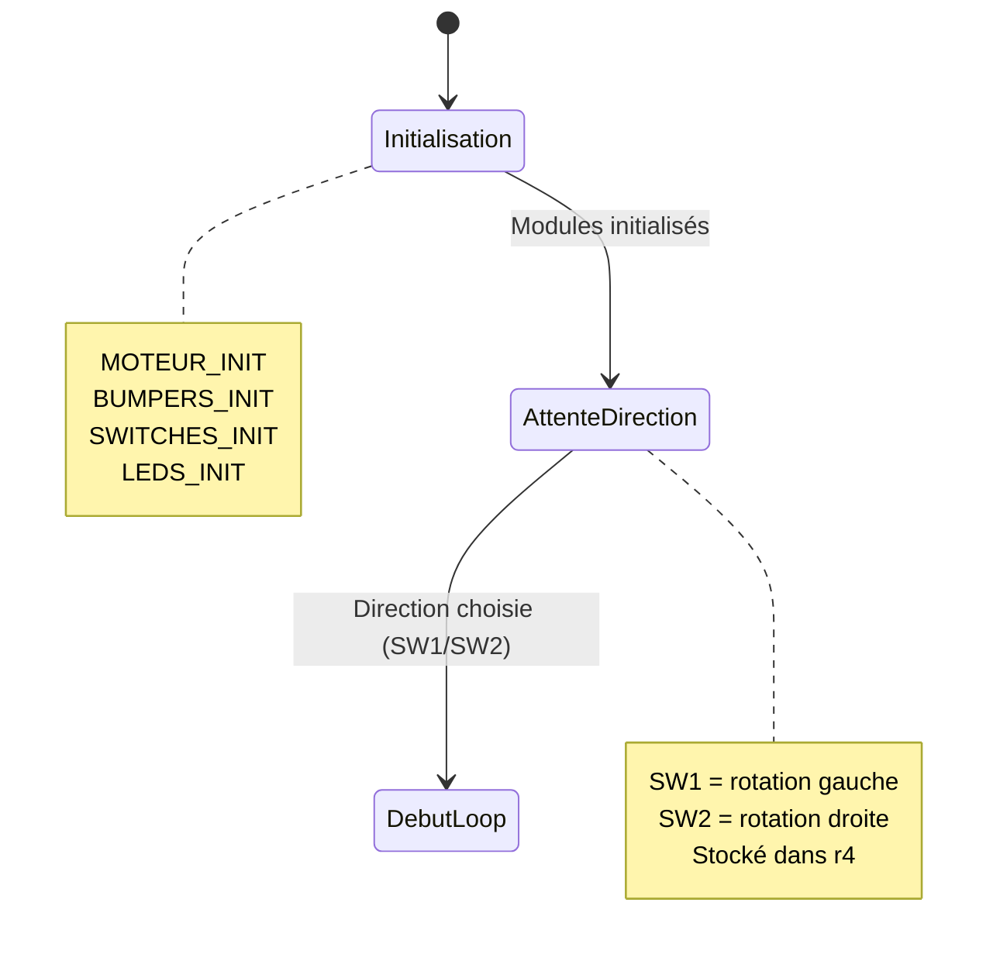
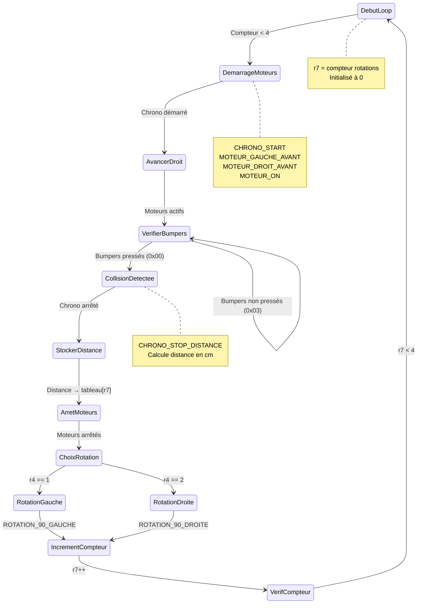
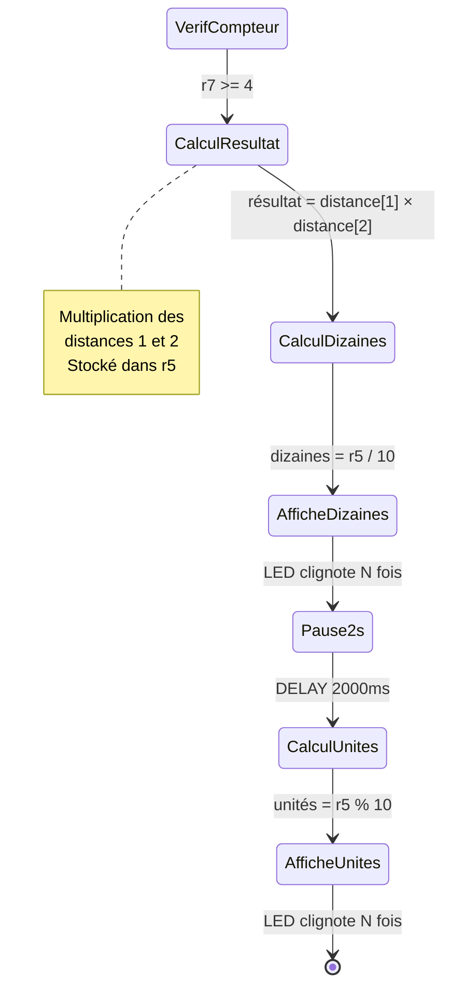

# ing1-s1-architecture-project

Program for Stallaris Evalbot robot which calculate the area of a room

# Development research

- Robot speed = 2cm/s (at full speed = 0x192)
- Robot length = 10cm

# State diagram

## Initialisation

## Boucle

## Résultat

