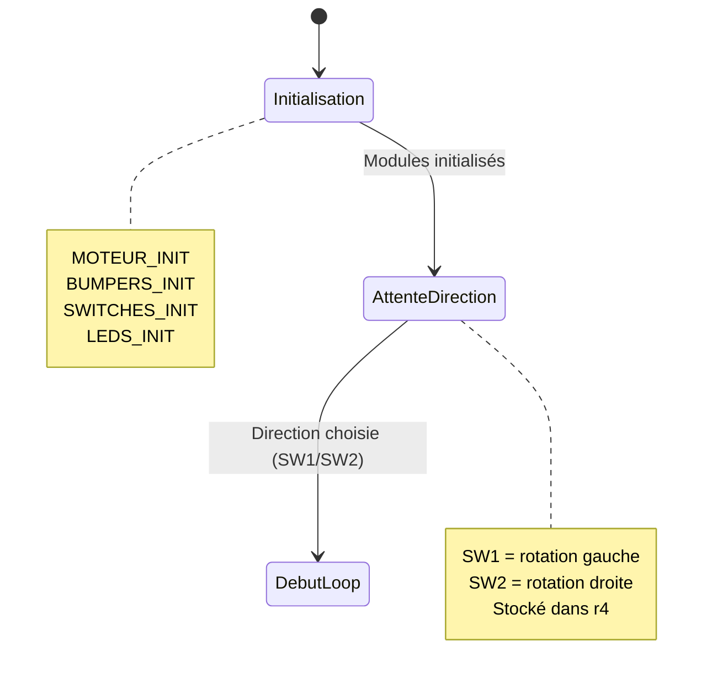
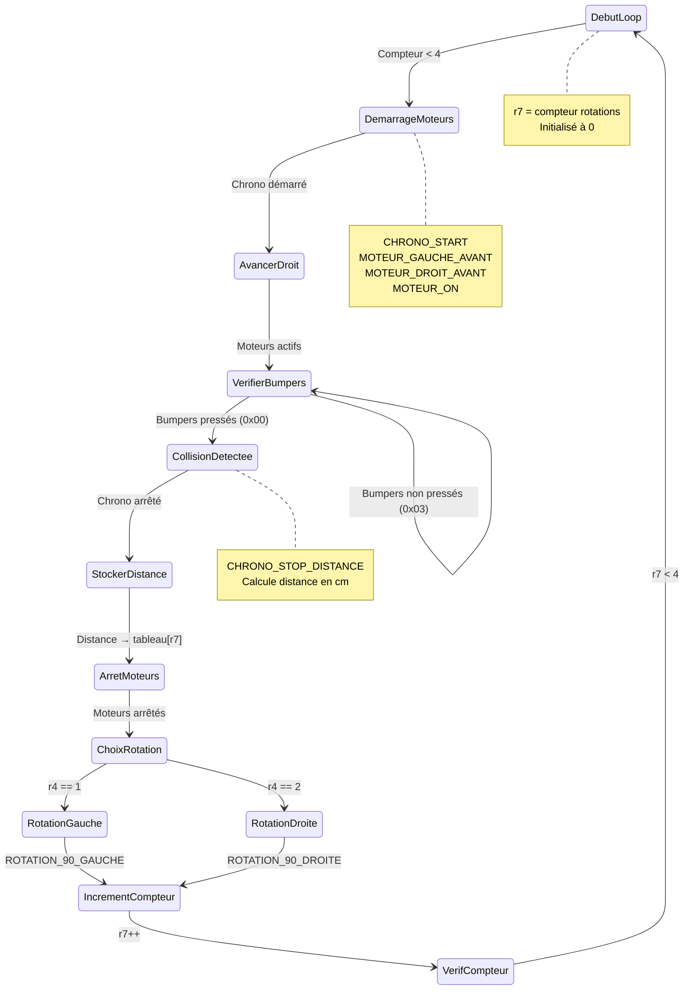
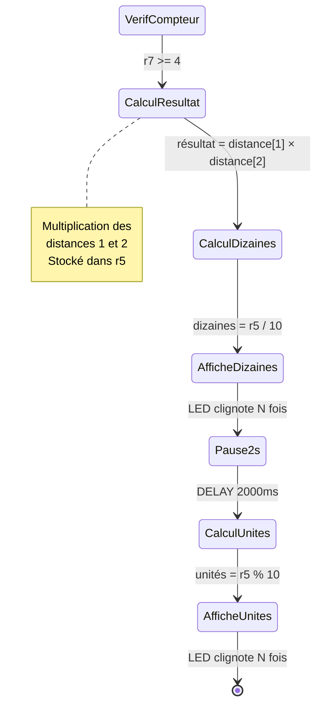

# ing1-s1-architecture-project

Program for Stallaris Evalbot robot which calculate the area of a room

# Development research

-   Robot speed = 2cm/s (at full speed = 0x192)
-   Robot length = 10cm

# State diagram

## Initialisation



## Boucle



## Résultat



# GPIO config

## 📋 Synthèse des Configurations GPIO - EvalBot LM3S1968

### **1. BUMPERS (Capteurs de collision) - Port E**

📍 **Fichier:** bumpers.s

**Broches utilisées:**

-   **PE0** : Bumper 1 (avant)
-   **PE1** : Bumper 2 (arrière)

**Configuration GPIO:**

```
• SYSCTL_RCGC2 |= 0x10 → Activation horloge Port E
• GPIO_DIR = INPUT (bits 0,1 = 0)
• GPIO_PUR |= 0x03 → Pull-up activé
• GPIO_DEN |= 0x03 → Fonction digitale activée
```

**Justification des choix:**

-   **Pull-up activé** : Les bumpers sont des interrupteurs normalement ouverts. Le pull-up tire la broche vers VDD (3.3V) quand le bumper n'est pas pressé (état = 1). Quand le bumper est pressé, il court-circuite à la masse (état = 0).
-   **Mode INPUT** : Les bumpers sont des capteurs qui envoient des signaux au microcontrôleur, pas des actionneurs.

---

### **2. ENGINE (Moteurs) - Ports D et H**

📍 **Fichier:** engine.s

#### **Port D - Moteur Droit**

**Broches utilisées:**

-   **PD0** : PWM0 (commande vitesse moteur droit)
-   **PD1** : PWM1 / Phase_R (direction moteur droit)
-   **PD2** : SlowDecay (commune aux 2 moteurs)
-   **PD5** : Enable 12V (convertisseur DC/DC)

**Configuration GPIO:**

```
• SYSCTL_RCGC2 |= 0x08 → Activation horloge Port D
• GPIOAFSEL_D |= 0x01 → Fonction alternative sur PD0 (PWM)
• GPIOPCTL_D = 0x01 → Multiplexage PD0 = PWM0
• GPIO_DIR |= 0x27 → OUTPUT sur PD0,PD1,PD2,PD5
• GPIODR2R_D |= 0x27 → Courant 2mA
• GPIODEN_D |= 0x27 → Fonction digitale activée
• GPIODATA_D = 0x24 → SlowDecay=1, Enable12V=1, Dir=0, PWM=0
```

#### **Port H - Moteur Gauche**

**Broches utilisées:**

-   **PH0** : PWM2 (commande vitesse moteur gauche)
-   **PH1** : PWM3 / Phase (direction moteur gauche)

**Configuration GPIO:**

```
• SYSCTL_RCGC2 |= 0x80 → Activation horloge Port H
• GPIOAFSEL_H |= 0x01 → Fonction alternative sur PH0 (PWM)
• GPIOPCTL_H = 0x02 → Multiplexage PH0 = PWM2
• GPIO_DIR |= 0x03 → OUTPUT sur PH0,PH1
• GPIODR2R_H |= 0x03 → Courant 2mA
• GPIODEN_H |= 0x03 → Fonction digitale activée
• GPIODATA_H = 0x02 → Direction=1
```

**Justification des choix:**

-   **Fonction alternative (AFSEL)** : PD0 et PH0 utilisent le module PWM matériel pour générer des signaux PWM précis sans intervention CPU.
-   **GPIOPCTL** : Multiplexage nécessaire pour router les signaux PWM vers les bonnes broches physiques.
-   **Courant 2mA** : Suffisant pour piloter les circuits de commande des ponts en H (DRV8801RT).
-   **SlowDecay=1** : Mode de décélération progressive des moteurs pour un contrôle plus fluide.
-   **Enable12V=1** : Active le convertisseur DC/DC pour alimenter les moteurs en 12V.

---

### **3. LEDS (Indicateurs lumineux) - Port F**

📍 **Fichier:** leds.s

**Broches utilisées:**

-   **PF4** : LED droite
-   **PF5** : LED gauche

**Configuration GPIO:**

```
• SYSCTL_RCGC2 |= 0x20 → Activation horloge Port F
• GPIODIR_F |= 0x30 → OUTPUT sur PF4,PF5
• GPIODR2R_F |= 0x30 → Courant 2mA
• GPIODEN_F |= 0x30 → Fonction digitale activée
• GPIODATA_F = 0x00 → LEDs éteintes au démarrage
```

**Justification des choix:**

-   **Mode OUTPUT** : Les LEDs sont des actionneurs, elles doivent être commandées par le microcontrôleur.
-   **Courant 2mA** : Suffisant pour les LEDs standard avec résistances de limitation de courant.
-   **État initial = 0** : LEDs éteintes au démarrage pour éviter une consommation inutile.

---

### **4. SWITCHES (Boutons poussoirs) - Port D**

📍 **Fichier:** switches.s

**Broches utilisées:**

-   **PD6** : Switch 1 (bouton gauche)
-   **PD7** : Switch 2 (bouton droit)

**Configuration GPIO:**

```
• SYSCTL_RCGC2 |= 0x08 → Activation horloge Port D (déjà activé par ENGINE)
• GPIO_DIR = INPUT (bits 6,7 par défaut = 0)
• GPIO_PUR |= 0xC0 → Pull-up activé sur PD6,PD7
• GPIO_DEN |= 0xC0 → Fonction digitale activée
```

**Justification des choix:**

-   **Pull-up activé** : Même principe que les bumpers - switches normalement ouverts, pull-up tire vers VDD quand non pressé (état = 1), court-circuit à la masse quand pressé (état = 0).
-   **Mode INPUT** : Les switches sont des entrées utilisateur.
-   **Horloge déjà activée** : Le Port D est partagé avec les moteurs, donc l'horloge est déjà activée par `MOTEUR_INIT`.

---

### **5. TIMER (Chronomètre) - SysTick**

📍 **Fichier:** timer.s

**Configuration (pas de GPIO, utilise SysTick interne):**

```
• SYSTICK_LOAD = 0xFFFFFF → Période maximale (24 bits)
• SYSTICK_CTRL = 0x07 → Enable + Interruption + Clock source CPU
```

**Justification des choix:**

-   **Pas de GPIO** : SysTick est un timer interne ARM Cortex-M3, pas besoin de configuration GPIO.
-   **Interruptions activées** : Permet de mesurer des durées longues (plusieurs secondes) en comptant les débordements.
-   **Clock source = CPU** : Utilise l'horloge système 16 MHz pour une précision maximale.

---

## 🎯 Points clés des configurations

1. **Entrées (INPUT)** : Toutes avec pull-up pour éviter les états flottants
2. **Sorties (OUTPUT)** : Courant limité à 2mA sauf si besoin spécifique
3. **PWM** : Utilisation de la fonction alternative pour générer des signaux précis
4. **Ports partagés** : Le Port D est utilisé à la fois pour les moteurs (PD0-2,5) et les switches (PD6-7)
